# Indian Folk Painting-NST
Neural Style Transfer (NST) to generate personalized/customized India Folk Style painting using the latest development in deep learning.

| Content Image | Style Image | Output Image |
|---------------|------|--------------|
| 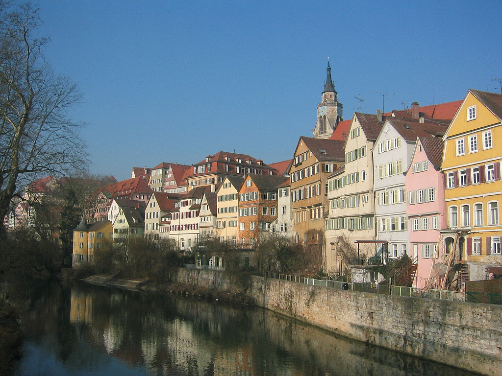  | 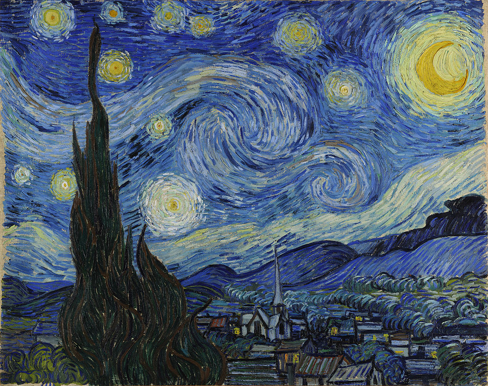 |  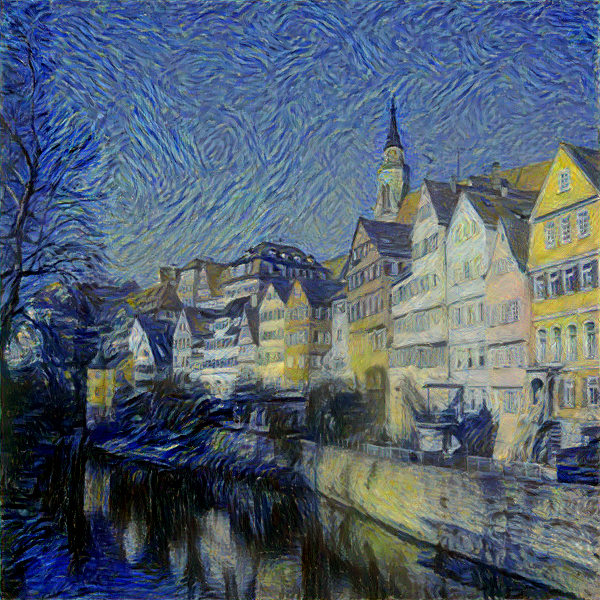         |
| 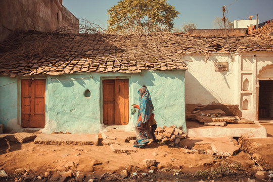  | 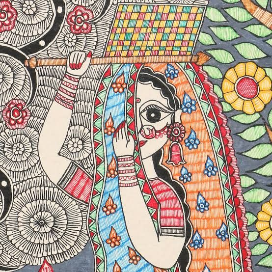 |  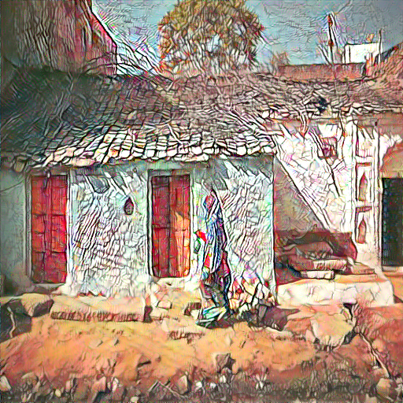  |
 | 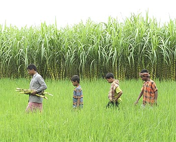 | 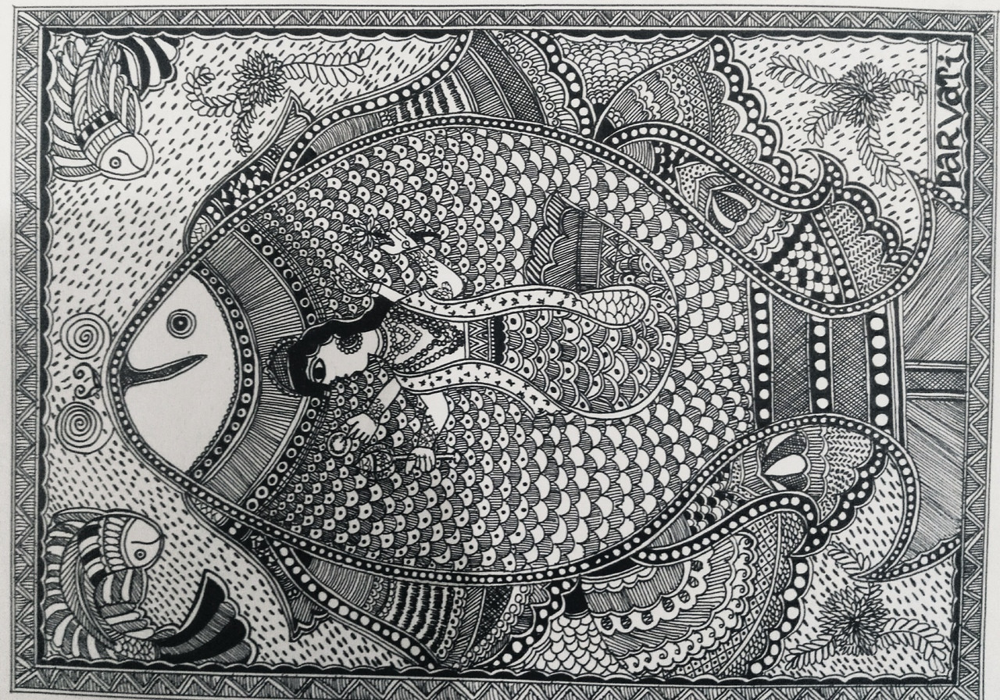 | 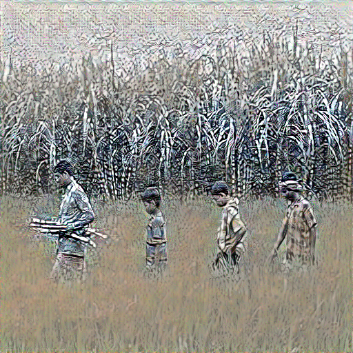|
 | 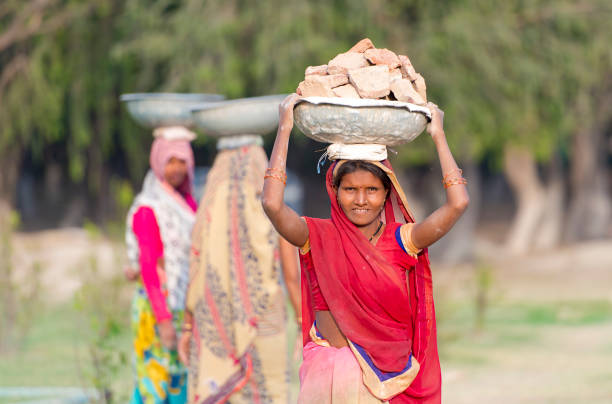 | 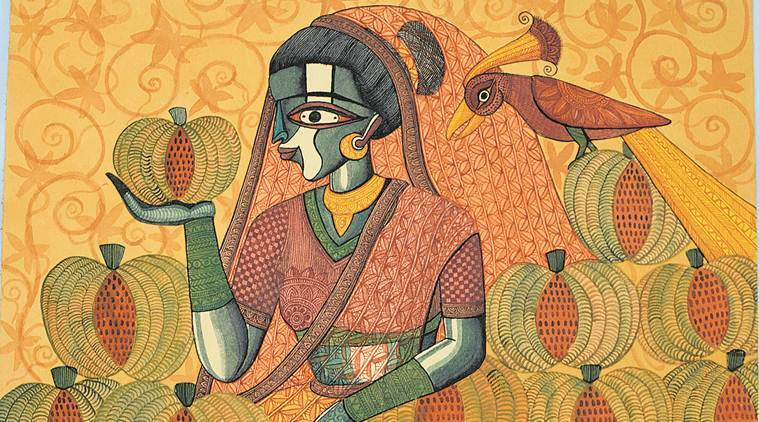|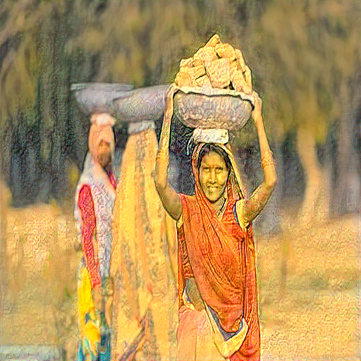|
## Resources
1) [Image Style Transfer Using Convolutional Neural Networks ](Image Style Transfer Using Convolutional Neural Networks)
